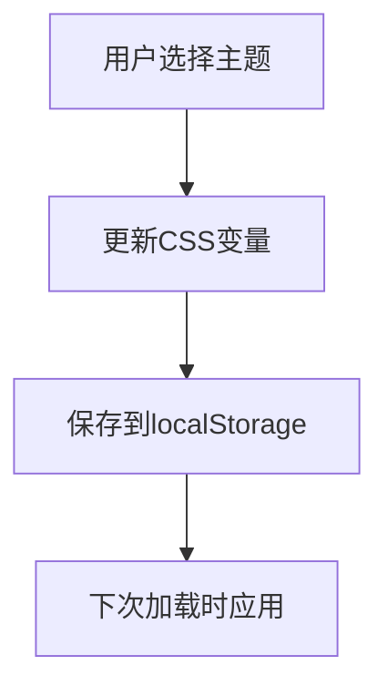

# NAS导航页技术选型详细对比

## 核心框架选择
| 方案           | 体积   | 优点                          | 缺点                  |
|----------------|--------|-------------------------------|-----------------------|
| Vue3           | 23KB   | 组合式API、更好的TS支持        | 学习曲线稍陡          |
| Preact         | 4KB    | 超轻量、React兼容              | 生态较小              |
| Svelte         | 2KB    | 无虚拟DOM、编译时优化          | 调试工具较少          |

## 状态持久化方案
| 方案                | 实现方式                  | 适合场景                |
|---------------------|---------------------------|-------------------------|
| Pinia+localStorage  | 自动同步到localStorage    | 需要离线持久化的SPA     |
| Vuex-persistedstate | 插件式持久化              | 已有Vuex项目迁移        |
| IDB                 | IndexedDB存储             | 大数据量存储需求        |

## 图标系统对比
| 方案         | 体积  | 特点                          | 推荐度 |
|--------------|-------|-------------------------------|--------|
| UnoCSS       | 2KB   | 纯CSS、按需生成               | ★★★★★ |
| Iconify      | 15KB  | 海量图标库                    | ★★★★☆ |
| SVG雪碧图    | 可变  | 高性能、但维护复杂             | ★★★☆☆ |

## 动态主题实现


## 多架构Docker构建验证
```bash
# 验证命令
docker buildx build --platform linux/amd64,linux/arm64 -t nas-dashboard .
